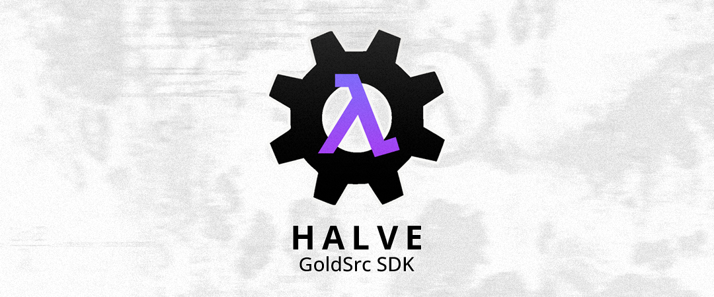
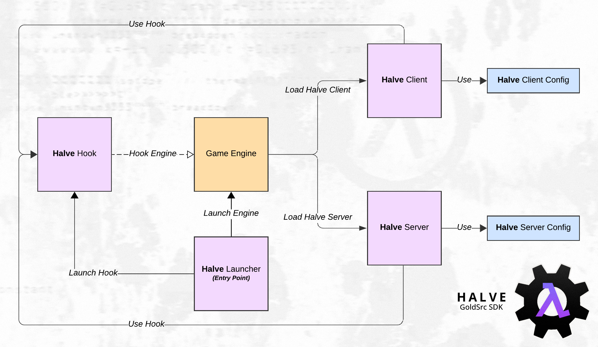

# Halve: GoldSrc SDK

    

**Halve** is an extended SDK for the latest version of the GoldSrc Engine, built on the Half-Life 1 SDK by  Valve Corporation. The main purpose of the project is to improve and reorganize the current version of the Half-Life 1 SDK and add new features for the development of new mods.

## Warning

**By default, Halve uses a hook to intercept and manipulate dynamic library functions during execution. This may cause issues with Valve Anti-Cheat (VAC). Use at your own risk or turn off the hook!**

## Table of Contents
- Description
- Installation
- Configuration
- Tools and Features
- Documentation
- Troubleshooting
- Screenshots

## Description

    

Halve involves several modules during the execution process, such as Halve Launcher, Halve Hook, Halve Client and Halve Server. More details you can find in the documentation.

## Installation

## Configuration

## Tools

## Features

## Usage

## Documentation

## Troubleshooting

## Screenshots
